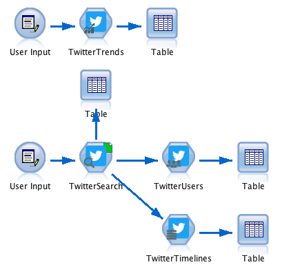

### Discover The New Palette of SPSS Modeler Twitter Nodes

  

* **Twitter Trends**: So what's going on right now at a specific location or worldwide.
* **Twitter Search**: Search twitter for a specific keyword.
* **Twitter Users**: Get all details about users who tweeted about a keyword.
* **Twitter Timelines**: Get all tweets of a list of users.

---

### Quickstart

1. You need 4 twitter access tokens for all request. If you don't have them already, read [this tutorial](#how-to-get-a-twitter-access-tokens--step-by-step-tutorial).

2. Download and install the [Twitter.mpe file](Twitter.mpe) in SPSS Modeler or search for 'Twitter' in the Predictive Extensions Hub (klick [here](#installation) for detailed instructions).

3. Download the [example stream](example.str) to get started.

  

### How to Get a Twitter Access Tokens – Step by Step Tutorial

_You need these access tokens to obtain data from Twitter by using the Twitter nodes._

The witter access tokens consist of four different alpha-numeric keys: _API Key_, _API Secret_, _Access Token_ and _Access Secret_. They can be quickly generated, however you might run into issues while developing your stream. That is due to restrictions Twitter has to not abuse their API. Should you run into errors give [this](https://dev.twitter.com/overview/general/things-every-developer-should-know) a read. You can find a table of all rate limits [here](https://dev.twitter.com/rest/public/rate-limits).

1. Go to https://twitter.com/apps/new

2. Log in with your Twitter credentials.  
Facebook will ask you first to register as a developer if you haven't already done it. Therefore they want your phone number. Klick on your profile picture on the twitter home page, then '**Settings**' and then '**Mobile**'. Enter your phone number here and proceed with the steps.

3. Enter an App name, a description, a website (mandatory field, but does not have to be an actual website. Use for example http://local.host), accept the developer agreement and click on '**Create your Twitter application**'

4. Click on '**Keys and Access Tokens**'

5. Scroll down on this page and select '**Create my access token**'

6. Now the page shows all four keys you need. The _API Key_, _API Secret_, _Access Token_ and _Access Secret_. Copy them all and save them somewhere.

  **Congrats with these keys you now can send Twitter API requests**

### Requirements
* R version that suits your SPSS Modeler version (Min. v2.15.2; does not matter on Mac OS)
* SPSS Modeler v18.0 or later
* SPSS Modeler ‘R essentials’ plugin

### Installation
In SPSS Modeler Click on '**Extensions**' --> '**Install Local Extenstions Bundle...**' and navigate to the [Twitter.mpe](Twitter.mpe) file in this folder.  
**_or..._**  
In SPSS Modeler Click on '**Extensions**' --> '**Extensions Hub...**', search, '**Facebook Posts**' and click '**Install...**'.

### R packages used
TwitteR: http://geoffjentry.hexdump.org/twitteR.pdf
