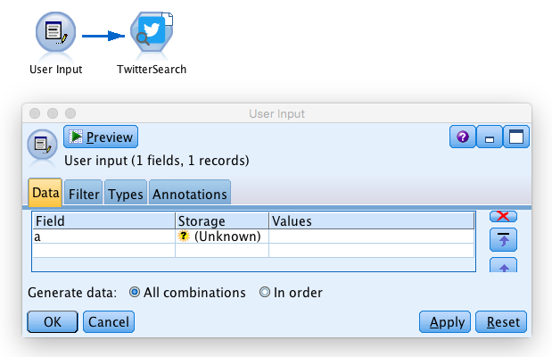
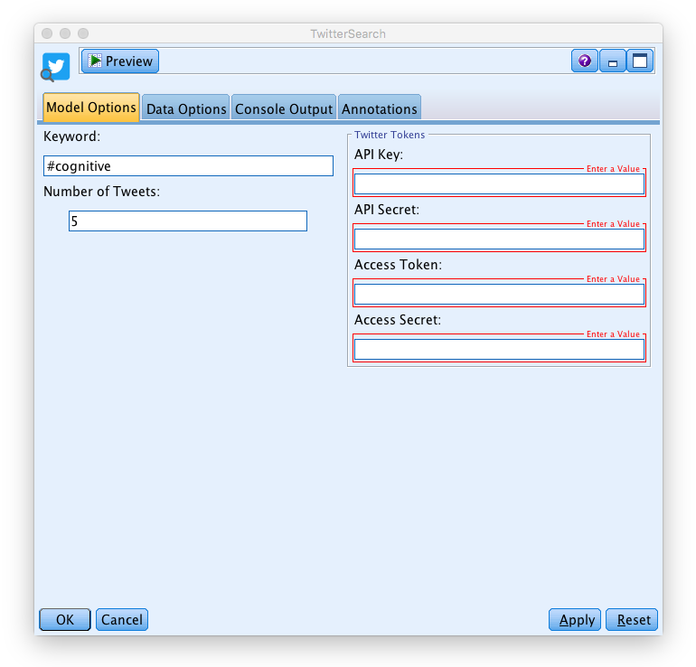
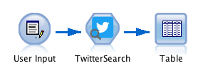
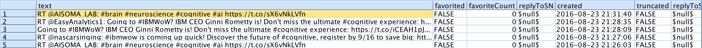

### 'Twitter Search' Node for IBM SPSS Modeler

_The Twitter Search Node returns all tweets to a topic of your choice with all relevant information_

  

#### Description:
This SPSS Modeler ‘source’ node allows you to import Tweets from around the world. Simply install the node, select a keyword (e.g. your company's hashtag) paste your authentication keys and choose the number of tweets you would like to import. Afterwards you can start doing text analysis on social data and get insights for your business.

---

You can start with the stream ['**example.str**'](../example.str) provided in this repository.

###### 1\.  
In SPSS Modeler v18.0 it is not possible to create proper ‘source’ nodes with R code. However it is made possible if you trick the software a bit: you just have to put a user input with fake fields before the Twitter node in order to start the stream. In this example we use a user input with: Field a (see the screenshot below).

  

###### 2\.  
Double click on the ‘Twitter Search’ node.

  

Now fill the fields:
* ‘Keyword’. Simply type in any keyword you would like to search on twitter. You only can search for one keyword at a time.
* ‘Number of Tweets’. The number you specify is the maximum number of tweets returned.
* ‘Twitter Tokens’. To access data from Twitter you need fours authentication keys that enable you the access via the API. Follow the [tutorial](https://github.com/jonnyenglish/SPSSFacebook#how-to-get-a-facebook-access-token--step-by-step-tutorial).
* _on the 'Data Options' tab make sure to select '**Read data in batches**'._

  

###### 3\.
Add an output node after the ‘Twitter Search’ node, in order to visualize the data you gathered. For example you can start with a ‘Table’.
Click on the table and run the stream.

  

Here is what we obtain:

  

Check the output of a small sample to see all the fields you get.

###### 4\.
Now, it’s your turn to gather social data directly into SPSS and start text mining customer opinions. [This](http://www.brianmcnay.com/text-mining/text-mining-tutorial-using-spss-modeler.html) is a good Tutorial to get started.
