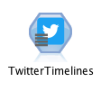
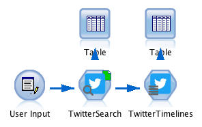
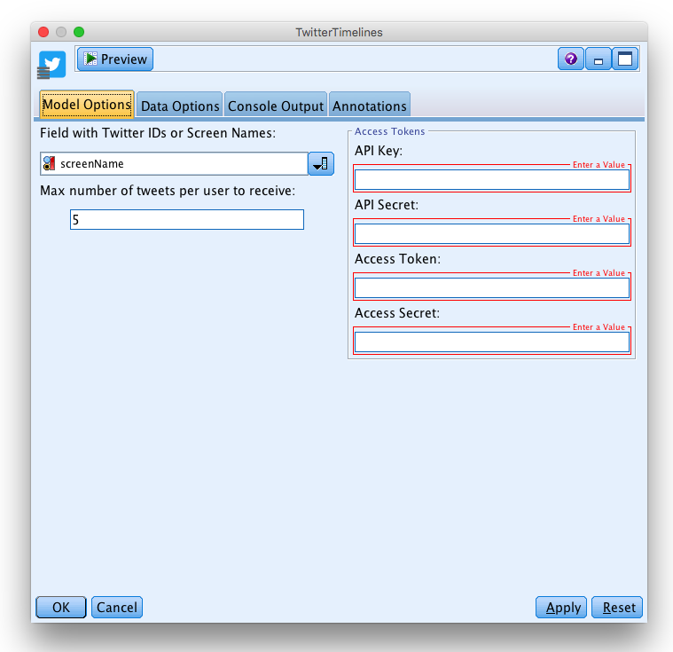
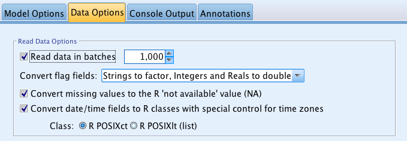
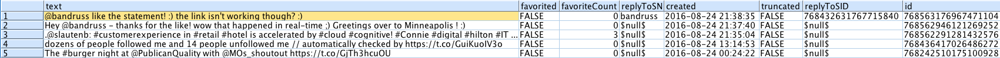

### 'Twitter Timelines' Node for IBM SPSS Modeler

_The Twitter Timelines Node allows you to gather all tweets of a list of users that you chooose as an input_

  

#### Description:
This SPSS Modeler process node allows you to import Tweets from users around the world. Simply install the node, select a column with user names or IDs (that you might get with the 'Twitter Search' Node), paste your authentication keys and choose the number of tweets you would like to import for each user. Afterwards you can start doing text analysis on social data and get insights for your business.

---

You can start with the stream ['**example.str**'](../example.str) provided in this repository.

###### 1\.  
What you need is a column containing Twitter user names or IDs. You can generate such a field with the user input node (type the name of your field and in the right column type a list of usernames separated by a space) or you can use the result of the '[Twitter Search' Node](../Twitter Search).

  
  

###### 2\.  
Double click on the 'Twitter Timelines' node.

  

Now fill the fields:
* 'Field with Twitter IDs or Screen Names'. This is the field you need to provide. Possible fields are described in step 1.
* ‘Number of Tweets per user to receive’. The number you specify is the maximum number of tweets returned for each user.
* ‘Twitter Tokens’. To access data from Twitter you need fours authentication keys that enable you the access via the API. Follow the [tutorial](https://github.com/jonnyenglish/SPSSFacebook#how-to-get-a-facebook-access-token--step-by-step-tutorial).
* _on the 'Data Options' tab make sure to select '**Read data in batches**'._

  

###### 3\.
Add an output node after the ‘Twitter Search’ node, in order to visualize the data you gathered. For example you can start with a ‘Table’.
Click on the table and run the stream.

  

Here is what we obtain:

  

Check the output of a small sample to see all the fields you get.

###### 4\.
Now, it’s your turn to gather social data directly into SPSS and start text mining customer opinions. [This](http://www.brianmcnay.com/text-mining/text-mining-tutorial-using-spss-modeler.html) is a good Tutorial to get started.
