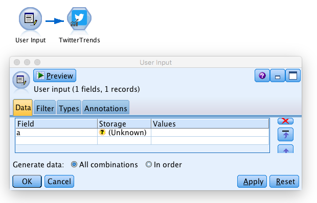
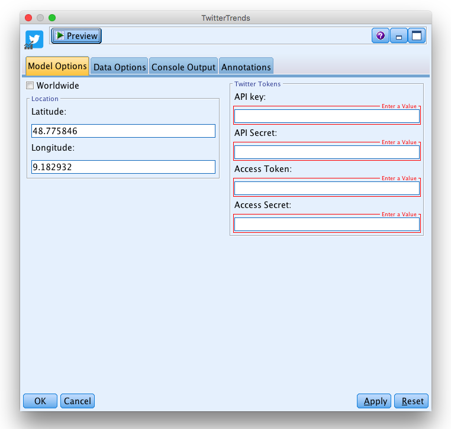
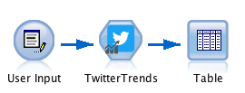

### 'Twitter Trends' Node for IBM SPSS Modeler

_The Twitter Trends Node returns all viral topics on Twitter right now. You can choose your location or just look at worldwide trends._

  

#### Description:
This SPSS Modeler ‘source’ node allows you to import trends on Twitter right now. Simply install the node, select a location, paste your authentication keys and run the stream. Unfortunately Twitter's API doesn't let us go back in time. So if you need a history of trends just write the results to a database and let the stream run on a schedule.

---

You can start with the stream ['**example.str**'](../example.str) provided in this repository.

###### 1\.  
In SPSS Modeler v18.0 it is not possible to create proper ‘source’ nodes with R code. However it is made possible if you trick the software a bit: you just have to put a user input with fake fields before the Twitter node in order to start the stream. In this example we use a user input with: Field a (see the screenshot below).

  

###### 2\.  
Double click on the ‘Twitter Search’ node.

  

Now fill the fields:
* 'Worldwide'. Choose whether you need worldwide trends or from a specific location.
* ‘Location’. If Worldwide is unselected, type in a latitude and a longitude. The trends returned will be from the closest location Twitter knows.
* ‘Twitter Tokens’. To access data from Twitter you need fours authentication keys that enable you the access via the API. Follow the [tutorial](https://github.com/jonnyenglish/SPSSFacebook#how-to-get-a-facebook-access-token--step-by-step-tutorial).
* _on the 'Data Options' tab make sure to select '**Read data in batches**'._

  

###### 3\.
Add an output node after the ‘Twitter Search’ node, in order to visualize the data you gathered. For example you can start with a ‘Table’.
Click on the table and run the stream.

  

Here is what we obtain:

  

###### 4\.
Now, it’s your turn to import trends on Twitter into SPSS and start analyzing what customers are talking about.
